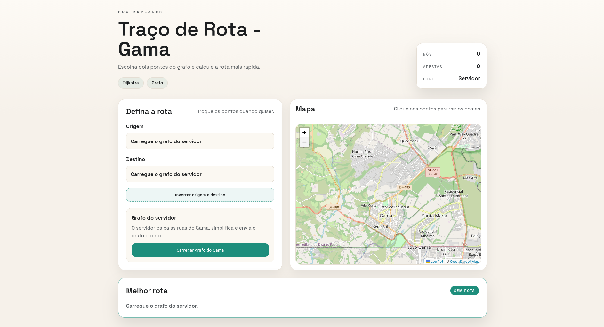
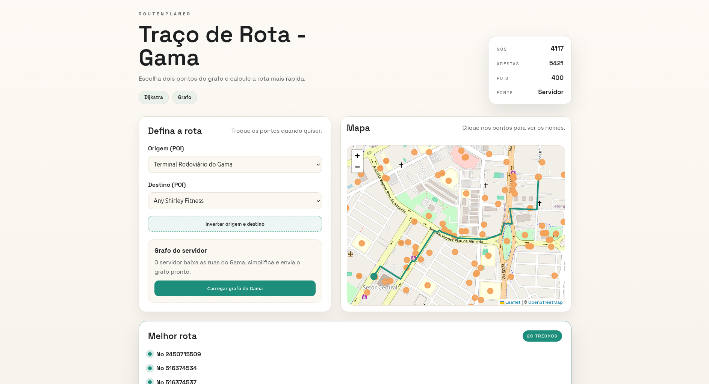
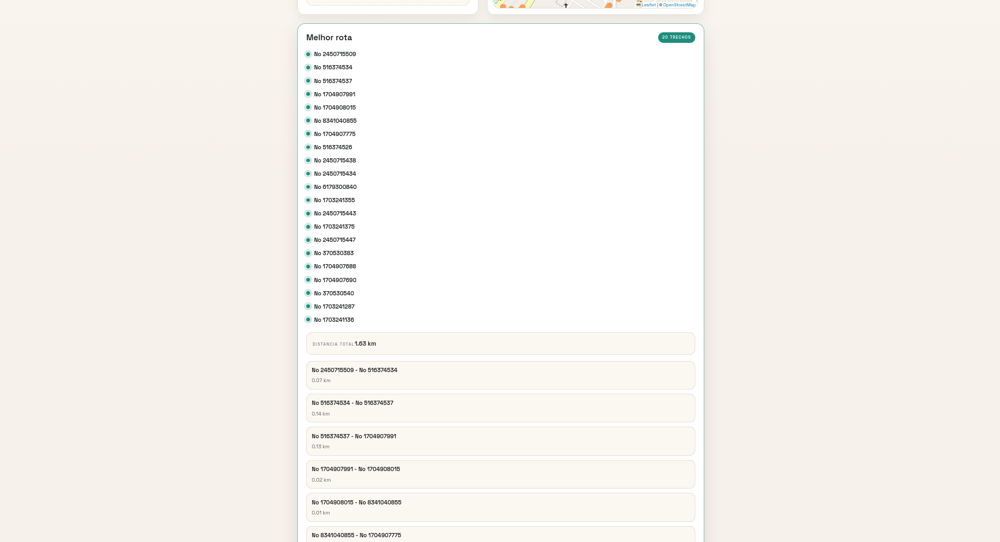

# Routenplaner

Conteúdo da Disciplina: Grafos<br>

## Alunos
| Matrícula | Aluno |
| -- | -- |
| 211061583  |  Daniel Rodrigues da Rocha |
| 211061618  |  Davi Rodrigues da Rocha |

## Sobre 
O RoutenPlaner é um projeto da disciplina de Grafos focado em planejamento de rotas urbanas no Gama (DF). A proposta é representar a malha viária como um grafo ponderado e calcular, em tempo de execução, o menor caminho entre dois pontos.
Com isso, o projeto integra conceitos de modelagem de grafos, busca de caminho mínimo utilizando o método Dijkstra em uma aplicação web.

## Screenshots








## Instalação 
Linguagem: JavaScript<br>
Framework: React<br>

### Pré-requisitos
1. Node.js 20.19+ (recomendado: Node.js 22)
2. npm (instalado junto com o Node)

### Passo a passo
1. Clone o repositório:

```bash
cd git clone https://github.com/projeto-de-algoritmos-2026/G11_Grafos_PA-26.1.git
```

2. Entre na pasta do projeto:

```bash
cd /caminho/para/G11_Grafos_PA-26.1
```

3. (Opcional, mas recomendado) Use o `nvm` para ativar Node 22:

```bash
nvm install 22
nvm use 22
node -v
```

4. Instale as dependências:

```bash
npm install
```

5. Inicie a API (terminal 1):

```bash
npm run dev:api
```

6. Inicie o frontend (terminal 2):

```bash
npm run dev
```

7. Abra no navegador:

```text
http://localhost:5173
```

### Verificações rápidas
1. API no ar:

```text
http://localhost:5174/api/health
```

2. Se aparecer erro de versão do Node no Vite, ative Node 22 e rode novamente:

```bash
nvm use 22
npm install
```

3. Se aparecer `ERR_MODULE_NOT_FOUND` (exemplo: `cors`), reinstale as dependências:

```bash
npm install
```

## Uso 
1. Com API e frontend rodando, abra `http://localhost:5173`.
2. Clique em **Carregar grafo do Gama** para baixar e montar o grafo da região.
3. Escolha origem e destino por lista de POIs (quando disponível) ou por seleção manual no mapa.
4. O sistema calcula automaticamente a melhor rota com Dijkstra.
5. Veja o resultado no mapa e no painel com caminho destacado, distância total e lista dos trechos da rota.
6. Use o botão **Inverter origem e destino** para comparar o percurso no sentido oposto.

## Outros 
- Versão online (Onrender): https://g11-grafos-pa-26-1-1.onrender.com/
- O projeto depende de acesso à internet para consultar a Overpass API e gerar o grafo da região.
- O recorte geográfico atual está focado na região administrativa do Gama (DF).